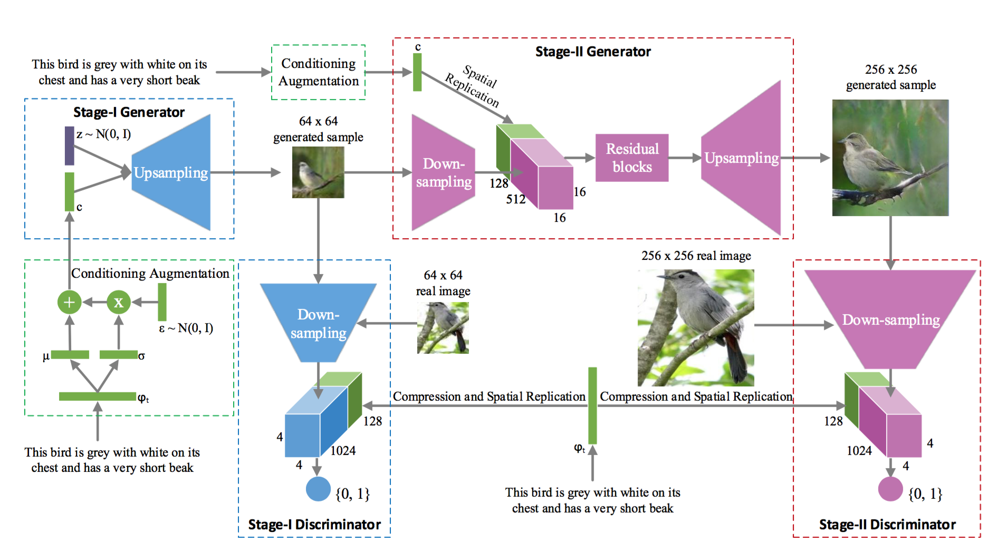
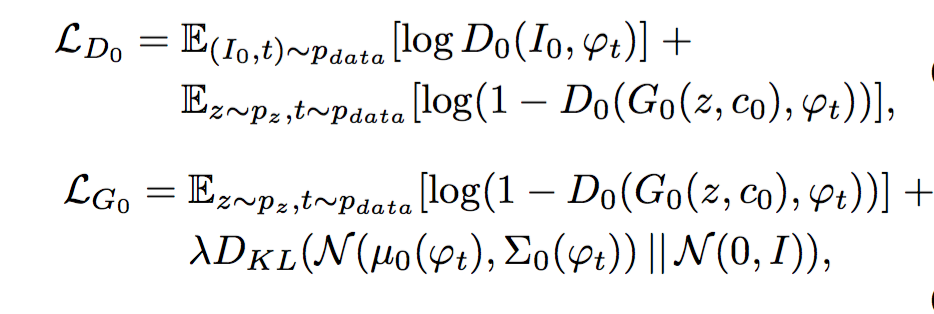
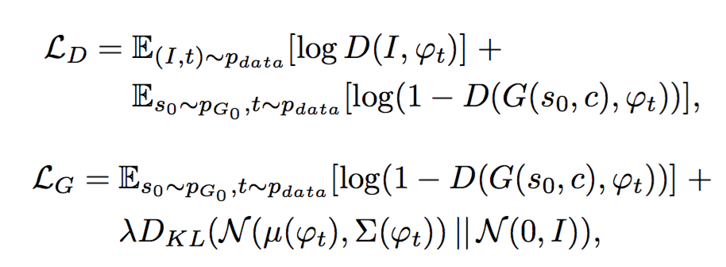

# StackGAN: Text to Photo-realistic Image Synthesis with Stacked Generative Adversarial Networks

## Task
Generate photo-realistic images conditioned on text descriptions.

## Architecture

### Stage-I GAN
- Purpose: Sketch the primitive shape and basic colors of the object based on the given text description, yielding Stage-I low resolution images.
- Embed description sentences using conditioning augmentation technique: Randomly sample latent variables from an independent Gaussian distribution N (μ(φt ), Σ(φt )), where the mean μ(φt ) and diagonal covariance matrix Σ(φt) are functions of the text embedding φt.

  **conditioning augmentation technique**: For each sentence embedding φt, we get 2 parameters by feeding φt to a fully-connected layer: (μ(φt ), Σ(φt )) which uniquely define a Gaussian distribution. We then sample from this Gaussian distribution to get the real conditioning vector ct to guide the generator: ct = μ(φt ) + Σ(φt ) ⊙ ε (where ⊙ is the element-wise multiplication, ε ∼ N (0, I )). In this way, we can cover much larger space in the embedding space with less training sentences.
- To further enforce the smoothness over the conditioning manifold and avoid overfitting, add the following regularization term: DKL(N (μ(φt), Σ(φt)) || N (0, I)), to the objective of the generator during training, which is the Kullback-Leibler divergence (KL divergence) between the standard Gaussian distribution and the conditioning Gaussian distribution.
- The loss of G and D in Stage-I GAN can be summarized as:

### Stage-II GAN
- Purpose: Correct defects in the low resolution image and complete details of the object by reading the text description again, producing a high resolution photo-realistic image.
- Stage-II GAN gets low resolution image generated by stage-I as well as text embedding φt. But it uses a different fully-connected layer to get different pair of (μ(φt), Σ(φt)) so that Stage-II generator might capture previously ignored information in the text.
- The loss of G and D in Stage-II GAN can be summarized as:

**Matching-aware discriminators in both stages**: The discriminators take real images and their corresponding text descriptions as positive sample pairs, whereas negative sample pairs consist of two groups. The first is real images with mismatched text embeddings, while the second is synthetic images with conditioning text embeddings.

## Reference
Zhang, Han, et al. "StackGAN: Text to Photo-realistic Image Synthesis with Stacked Generative Adversarial Networks." arXiv preprint arXiv:1612.03242 (2016).
