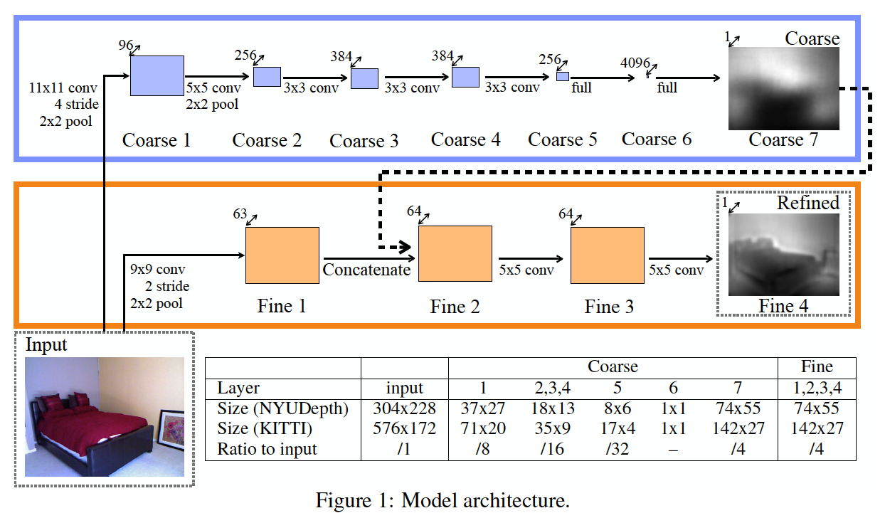

## Deep Map Prediction from a Single Image using a Multi-Scale Deep Network

#### Task

Estamate depth from a single image.

#### Main Idea

Employ two deep stacks: one that makes a coarse global prediction based on the entire image, and another that refines this prediction locally.

####Architecture

The task of the coarse=scale network is to predict the overall depth map structure using a global view of the scene.

Then train the fine-scale network keeping the coarse-scale output fixed.

#### Scale-Invariant Error

A scale-invariant error to measure the relationships between points in the scene, irrespective of the absolute global scale.

For a predicted depth map $y$ and ground truth $y^*$ , each with $n$ pixels indexed by $i$ , we define the scale-invariant mean squared error (in log space) as
$$
D(y,y^*) = \frac{1}{n}\Sigma(\log y_i - \log y^* + \alpha (y,y^*))^2
$$
where $\alpha(y,y^*) = \frac{1}{n}\Sigma(\log y^* - \log y_i)$

Then $D(y,y^*)$ can be rewritten as
$$
D(y,y^*) = \frac{1}{n^2}\Sigma((\log y_i - \log y_j) - (\log y_i^* - \log y_j^*))^2 \\
               = \frac{1}{n}\Sigma d_i^2 - \frac{1}{n^2}d_id_j \\
               =\frac{1}{n}\Sigma d_i^2 - \frac{1}{n}(\Sigma d_i)^2
$$

#### Training Loss

Per-sample training loss:
$$
L(y,y^*) = \frac{1}{n}\Sigma d_i^2-\frac{\lambda}{n^2}(\Sigma d_i^2)^2
$$
where $d_i= \log y_i - \log y_i^* $ and $\lambda \in [0,1]$

