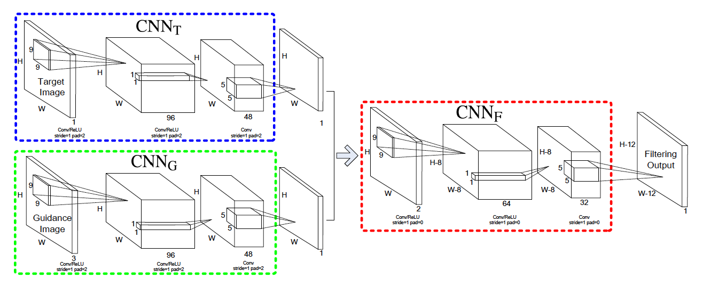
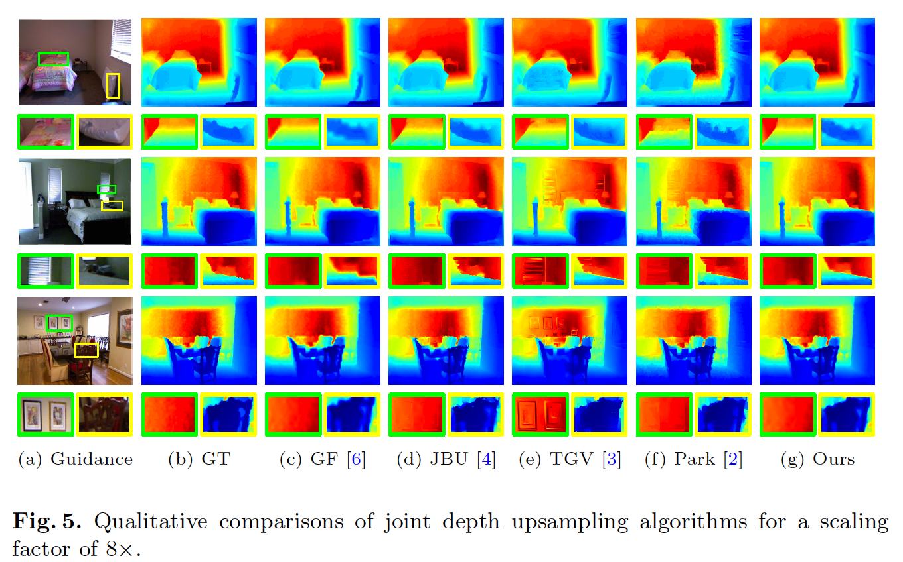
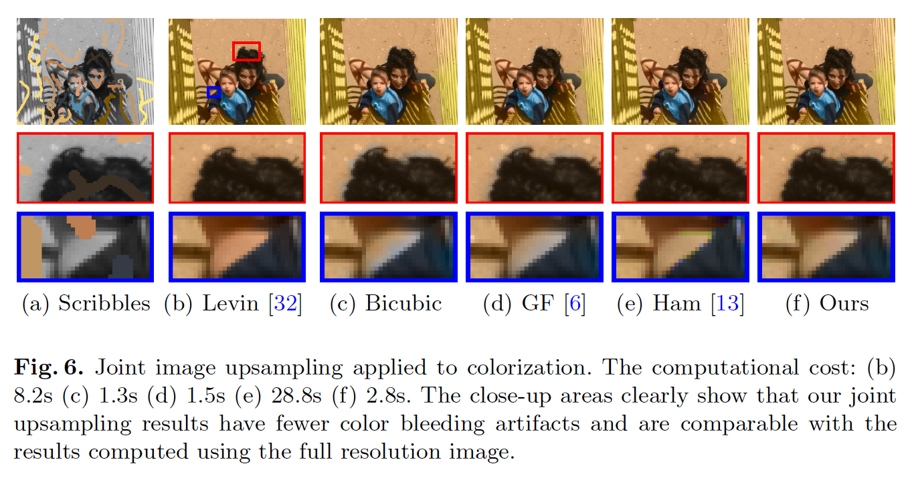
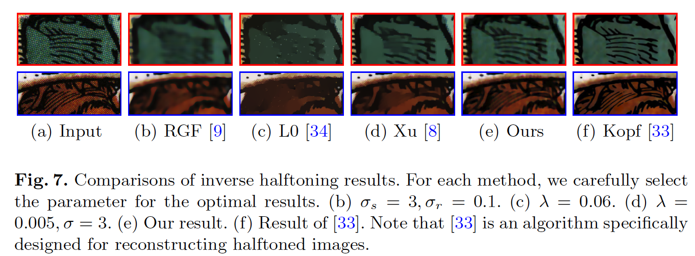
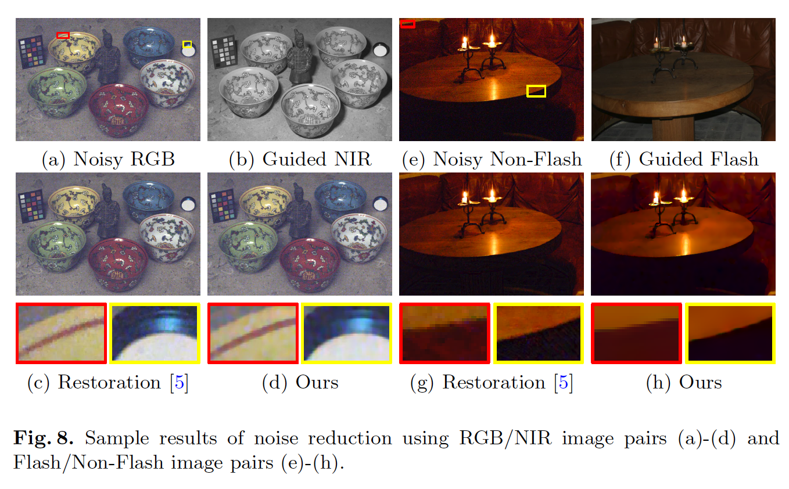

## Deep Joint Image Filtering

#### What is Joint Image Filtering

Transfer the structural details from the guidance image to the target image for suppressing noise or enhance spatial resolution.

#### What is Deep Joint Image Filtering

A learning-based joint filter based on CNN.

- without stage-wise training
- data-driven
- learns how to selectively transfer structures by leveraging prior from the guidance image, rather than predicting specific depth values

#### Related Work

Joint Image Filter can be calssified into two categories

- Explicit filter based: compute the filtered output as a weighted average of neighboring pixels in the target image.
- Global optimization based: formulate joint filtering using a global optimization framework. Global optimization based method often contains two terms, the first one is data fidelity that ensures the filtering output is close to the input target image. The second regularization term encourages the output to have a similar structure with the guidance.

#### Method

- $CNN_T$ : Take the target image as input and extract its feature map
- $CNN_G$ : Extract image from the guidance image
- $CNN_F$ : Take the concatenated feature as input and generates the final joint filtered result.

#### Experiments

###### Depth Map Upsampling

###### Joint Image Upsampling

###### Structure-texture seperation

######Corss-modality filtering for noise reduction (RGB/NIR, Flash/Non-Flash)

