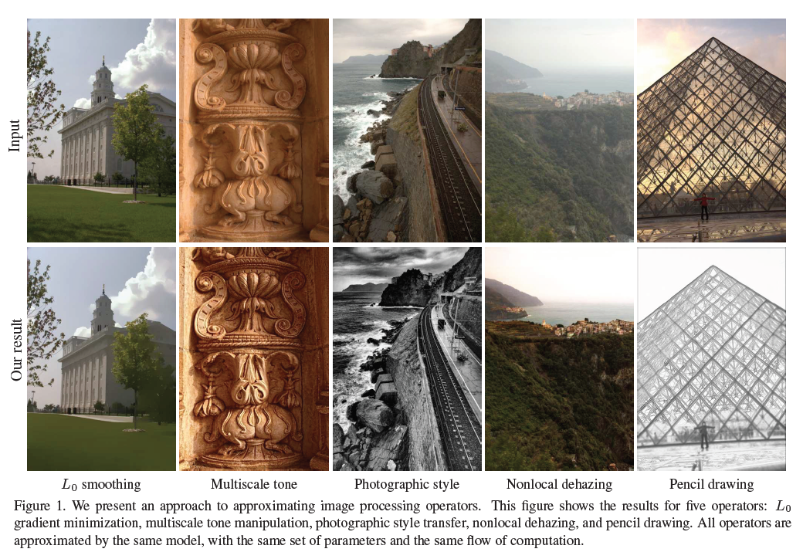

### Fast Image Processing with Fully-Convolutional Networks

#### Task

Train networks that approximate variety of image processing operators, including smoothing, multi scale tone, photographich style etc.

#### Method

$I$ is an image, $f$ is an operator that transforms the content of an image. The goal of this paper is to approximate $f$ with another operator $\hat{f}$ , such that $\hat{f}(I) \approx f(I)$ for all images $I$ .

#### Network

The network is a multi-scale context aggregation network with consecutive layers $\left\{L^0, …, L^d\right\}$ , each $L$ is a layer with dialated convolution (except for the laster two layers) $\rightarrow$ Adaptive Normalization $\rightarrow$ Leaky ReLU.

#### Adaptive Normalization

Combine batch normalization and identity mapping
$$
\phi(x) = \lambda_sx+\mu BN(x),
$$
where $\lambda_s,\mu_s \in \mathbb{R}$ are learned scalar weights and $BN$ is the batch normalization operator.

#### Loss

$$
l(K,B) = \Sigma \frac{1}{N_i}||\hat{f}(I_i,K,B) - f(I_i)||$2
$$

where $K,B$ are the kernels and biases in CNN and $N_i$ is the number of pixels in image $I_i$ .

#### Results

