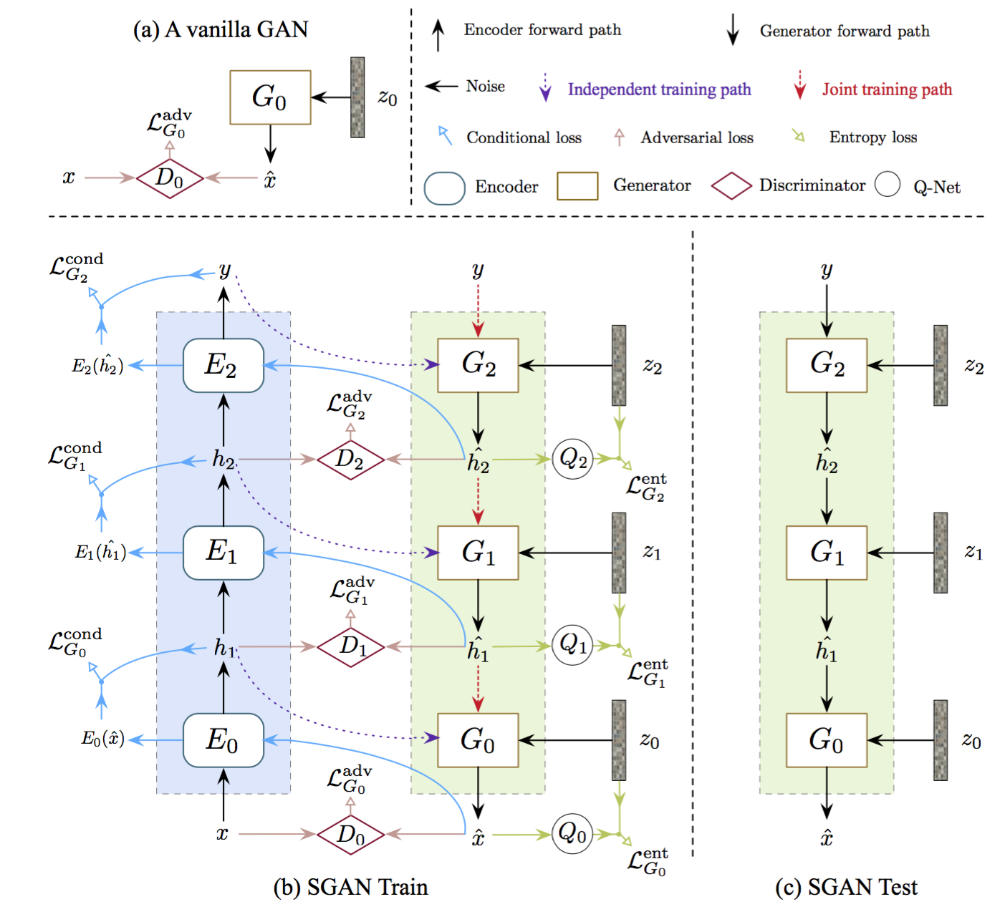
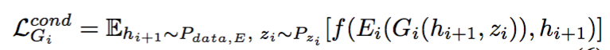
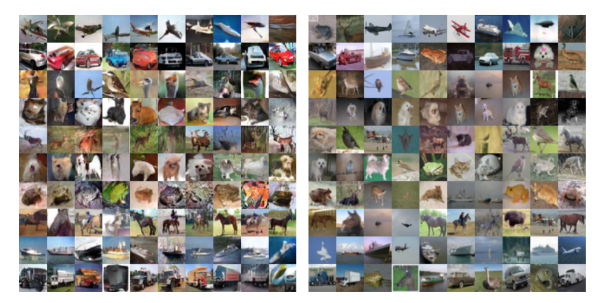

## Stacked Generative Adversarial Networks

### Main Idea

Use stacked generators and discriminators to map noise to real image.

### Architecture

- Ei: consists of a sequence of neural layers from a pre-trained DNN for classification.
- Gi: trained to invert the bottom-up Ei. i.e., Gi takes a higher-level feature h_(i+1) and a noise vector, outputs a lower-level feature hi.

### Objective
#### Adversarial Loss
For each generator Gi, there's a representation discriminator Di that distinguishes generated representation from "real" representation.

#### Conditional Loss
- Why use conditional loss? To prevent Gi ignore h_(i+1).
- How? Feed the generated lower-level representation hi back to Ei and compute the recovered higher-level representations. Then enforce the recovered representations to be similar to the conditional representations.

#### Entropy Loss
- Why use entropy loss? To prevent the generator Gi from ignoring the noise zi.
- How? By encouraging the generated representations hi to be sufficiently diverse when conditioned on h_(i+1). i.e. the conditional entropy H(hi|h_(i+1)) should be as high as possible.
Directly maximizing H(hi|h_(i+1)) is intractable, so they propose to maximize instead a variational lower bound on the conditional entropy.

Reparameterize Qi with a deep network that predicts the posterior distribution of zi given hi. Qi shares most of the parameters with Di and it only predicting the posterior mean, making the entropy loss equivalent to the Euclidean reconstruction error.

Intuitively explaining, Qi reconstructs zi from the generated hi to make sure hi doesn't ignore zi.

### Performance
So far, state-of-the-art CIFAR image generation.

### TL;DR
- They propose to stack mini generators, each one trained to invert the effect of several layers in a pre-train DNN. i.e. They learn to map from higher-level representations to lower-level representations. Through stacking, the hard image distribution learning task are decomposed into several easier feature distribution learning tasks.
- Tackle the common condition-ignore problems in GANs by conditional loss, which forces the generated feature to include information of the input feature.
- Tackle the common mode collapse problems (noise ignore problems) in GAN by maximizing entropy between input feature and generated feature.
