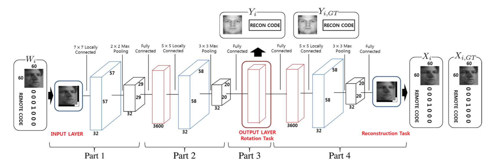

## TASK
Face frontalization.

## Method
- Input is an image with binary target pose code
- PartI, PartII and PartIII take this input and generate a frontalized face along with a code describing pose and illumination of the input image.
- PartIV then takes the generated frontalized face and code to reconstruct the input image and target pose code.
- Two L2 losses are used on the generated face and reconstruced face respectively.

## Reference
Yim J, Jung H, Yoo B I, et al. Rotating your face using multi-task deep neural network[C]//Proceedings of the IEEE Conference on Computer Vision and Pattern Recognition. 2015: 676-684.