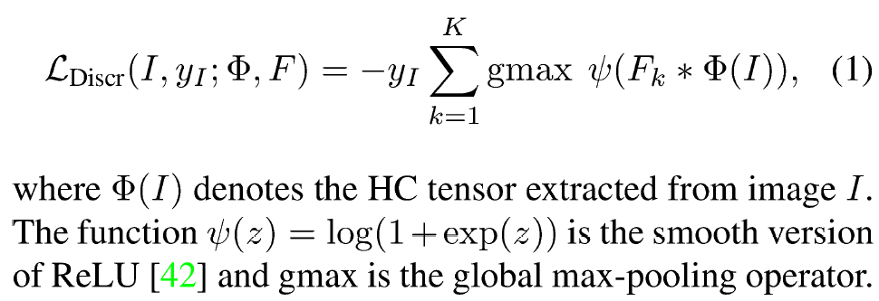
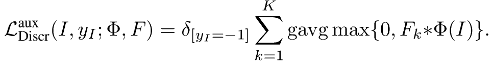
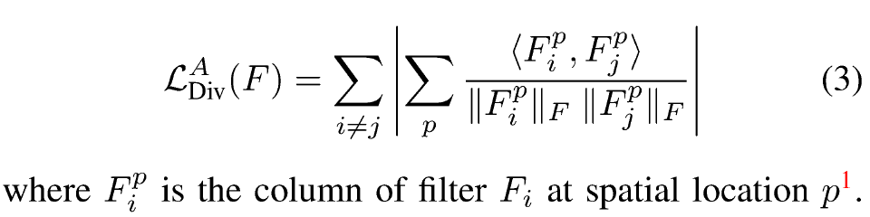
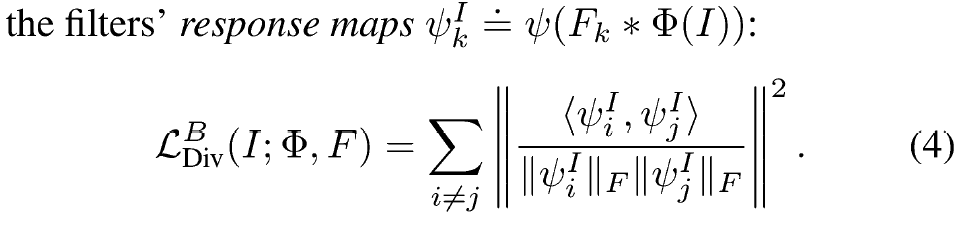
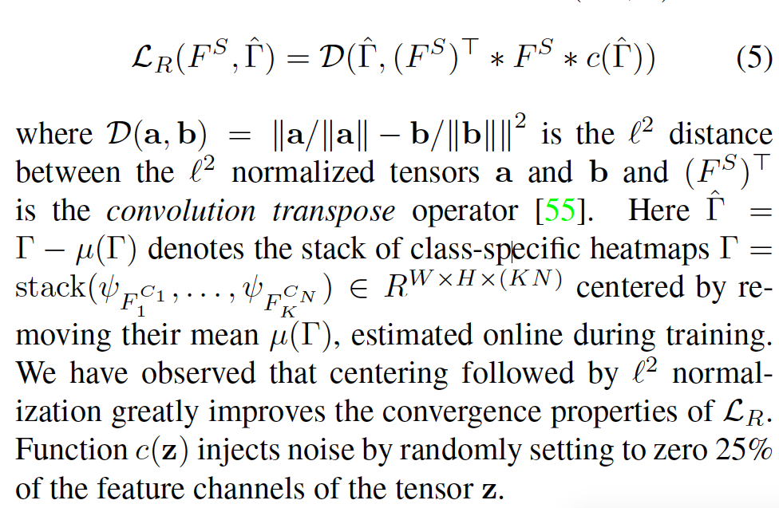
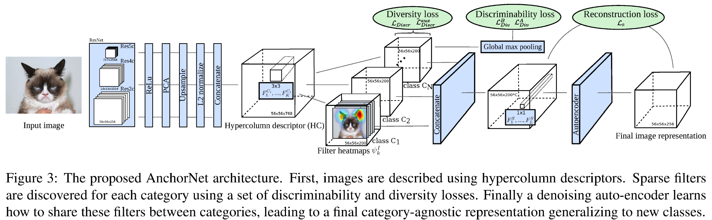

## AnchorNet: A Weakly Supervised Network to Learn Geometry-sensitive Features For Semantic Matching

### Abstract

- Main idea: A deep network, termed AncorNet produces image representations that are well-suited for semantic matching.
- Tasks:
  - Cross-instance matching: different instances of the same object category are matched.
  - Cross-category matching: align pairs of instances each from a different object class.

### Introduction

- Introduce a new deep architecture that:
  - learn representations that work well for cross-instance matching.
  - using only image-level labels.
  - contains a set of _sparse_ and _diverse_ filters.

### Method

- Hypercolumns: A hypercolumn d(u,v) at location (u,v) in the image is created by concatenating the convolutional feature responses at that location for different layers of the network.

- Then train 3x3 convolutional filters F1, F2,..., FK that compress the hypercolumns into a compact set of anchor filters that are suitable for matching. These filters are trained with two constraints:

  - **Discriminability constraints.** Discriminability is encouraged by minimizing the following loss function:

    

    This constraint basically means the response of the filters should be discrinative to do classification. A secondary loss is introduced only for negative samples to speed up training:

    

  - **Diversity constraints**. Two losses are used to maximizing the "coverage" of these filters, one loss is used to make all convolutional filters orthogonal to each other:

    

    Another loss is used to directly decorrelates the filters' response maps:

    

- Class-agnostic matching is achevied by introducing a new bank of 1x1 filters that projects the class-specific responses of the filters F1, F2, ..., FK to L general-purpose response maps. To learn L class-agnostic filters, they use a denoting auto encoder and minimize:

  

- The complete architecture is:

  

