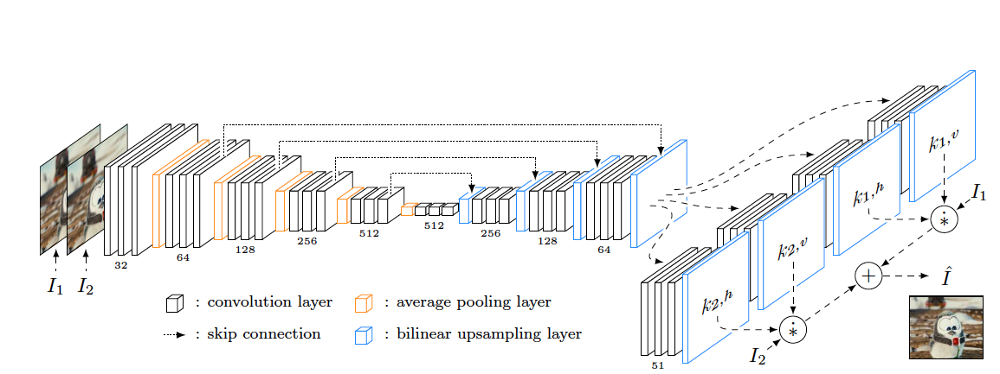
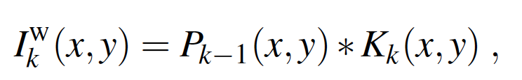
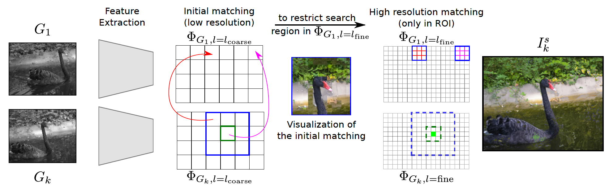
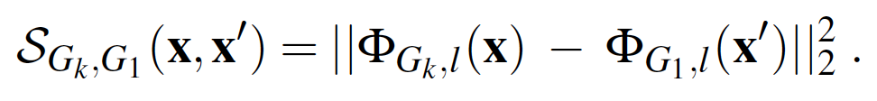
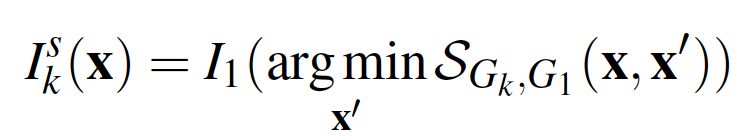
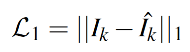
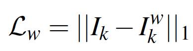

## Deep Video Color Propagation

### Abstract

A deep learning framework for color propagation that combines:

- A local strategy, to propagate colors frame-by-frame ensuring temporal stability.
- A global strategy, using semantics for color propagation within a larger range.

### Introduction

- Given the first frame of a sequence in color, the local strategy warps these colors frame by frame based on the motion.
- A global strategy to transfer colors of the first frame based on semantics, through deep feature matching.
- These approaches are combined through a fusion and refinement network to synthesize the final image.

### Overview

- Local strategy takes as input two consecutive gray scale frames and estimates a warping function (spatially adaptive kernel). This warping function is used to transfer the colors of the previous frame to the next one.
- The global strategy incorporate semantical information by matching deep features extracted from the first frame and the rest of the video.
- The final colored image is estimated by taking advantage of information that is present in both intermediate images, i.e. local and global color information.

### Approach

- Local strategy: colors of I1 can be sequencially propagated to the entire video using temporal consistency.

- Global strategy: colors present in I1 can be simultaneously transferred to all the frames of the video using a style transfer like approach.

  #### Local strategy

  Inputs in the local strategy are two grayscale frames G(k-1), G(k) and the colored frame I(k-1). First a convolution kernel K(k) is estimated based on G(k-1) and G(k) using a similar architecture shown below (instead of four kernels, here we only need a hironzontal kernel and a vertical kernel to approximate a 2D convolution kernel):

  

  Then the nth frame is obtained by convolving I(k-1) with the estimated kernel K(k) as:

  

  #### Global strategy

  

  The similarity of two positions is measured as:

  

  where  Φ is the deep feature extracted from a pre-trained ResNet. Then the color of a patch of frame k is transferred from its nearest neighbor in the first frame:

  

  Specifically, the matching has two stages. First conducted on a coarse level (conv3-block) to find a coarse ROI for each pixel (as the red and magenta arrow points to the neighbor of two patches respectively), and then search its nearest neighbor within the region using a more fine-grained feature (conv1-block) (e.g. the neighbor of the light green pixel should be searched in the squre with magenta grid).

  #### Refinement

  The refinement network is a FCN that takes two esitmated images from the local strategy and global strategy and output the final colored image.

  #### Losses

  - One L1 loss on final colored image:

    

  - One L1 loss on estimated image from the local strategy:

    