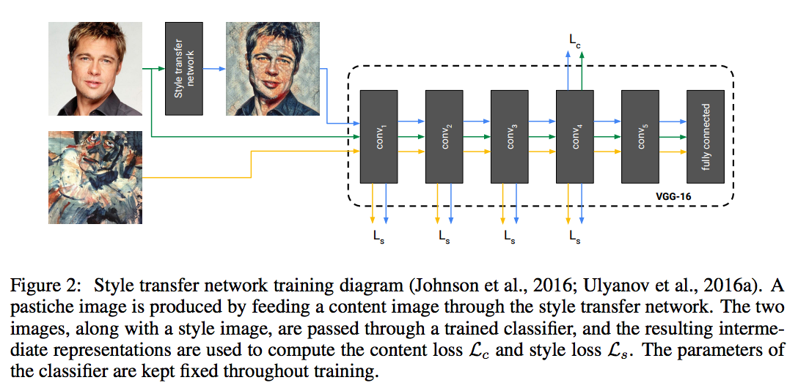
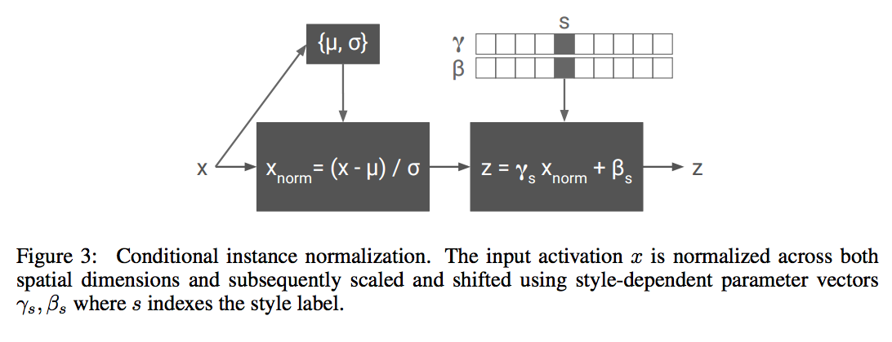
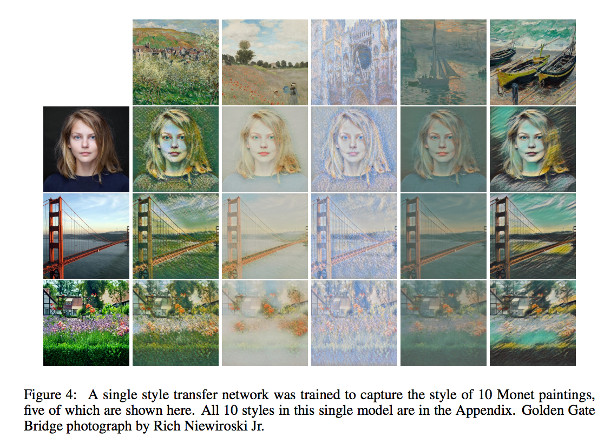

# A Learned Representation For Artistic Style

## Task
Train a neural network to learn multiple style-transfer.

## Main Idea 
### Network Architecture
The network architecture is the same with [feed forward neural style transfer]() with two modifications: 
1. Change zero-padding to mirror-padding.
2. Change transposed convolution to up-sampling with convolution.

### Conditional Instance Normalization
**Main Idea**: To model a style, it is sufficient to specialize scaling and shifting parameters after normalization to each specific style.

**Instance Normalization**:  Instance normalization normalizes feature maps after each convolution layer as: Xnorm = (X - μ) / σ. Where X is the feature map, μ, σ are mean and covariance of X.

**Conditional Instance Normalization**: Introduce two NxC matrixes parameters: γ, β (*N is the number of styles, C is the channel of feature map X*)  to normalize the feature map X as: Xnorm = γs((X - μ) / σ) + βs. γs and βs are the sth row of γ and β, specialized to scaling and shifting feature map X to match the sth style. Show as below:

## Results

## Reference
Dumoulin, Vincent, Jonathon Shlens, and Manjunath Kudlur. "A learned representation for artistic style." (2017).
