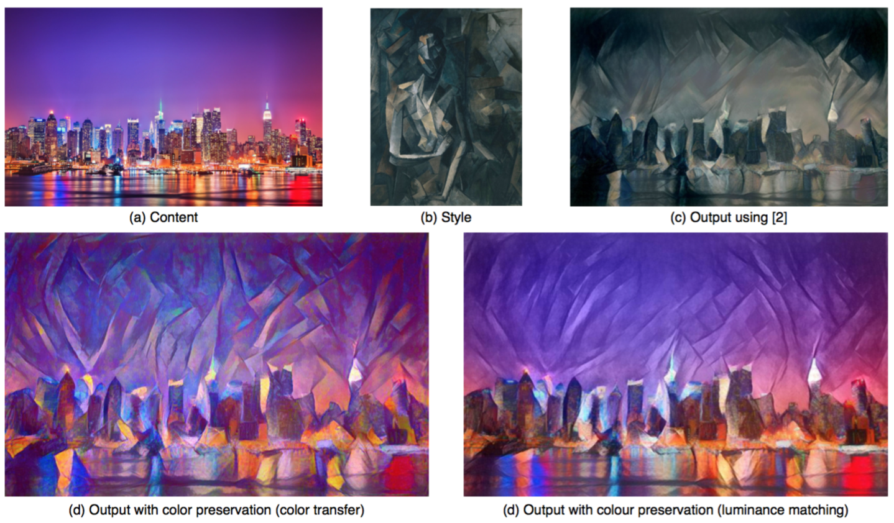

# Preserving Color in Neural Artistic Style Transfer

## Task
Transfer style while preserving colors.

## Main Idea
### Approach I
**Main Idea**:For the style image S, first use color histogram matching algorithm to generate a new style image S' which matches the color histogram of the content image. Then use S' as the style image and perform conventional neural style transfer algorithm with content image C.

**Problem Definition**: The linear transformation algorithm can be defined as: Given a style image xs, seek a 3x3 matrix A and a 3x1 vector b so that: b = μc−Aμs and AΣSAT = ΣC (μ and Σ are mean and covariance of color pixels ). Then the transferred style image xS' = AxS+b has the same mean and covariance of the color pixels with the content image.

**Solution**: Let the eigenvalue decomposition of a covariance matrix be Σ = UΛUT.Then, we define a matrix square-root as: Σ1/2 = UΛ1/2UT. By mathematical derivation, we get A = Σ1/2Σ-1/2.

### Approach II
Perform style transfer only in the luminance channel, then concatenate generated luminance channel with I and Q channel from the content image.

If there is a substantial mismatch between the luminance histogram of the style and the content image, it can be helpful to match the histogram of the style luminance channel LS to that of the content image LC before transferring the style. Let μS and μC be the mean luminance of the two images, and σS and σC be their standard deviations. Then each luminance pixel in the style image is updated as: LS′ = (σC/σS)(LS−μS)+μC.

## Results

## Reference
Gatys, Leon A., et al. "Preserving color in neural artistic style transfer." arXiv preprint arXiv:1606.05897 (2016).
